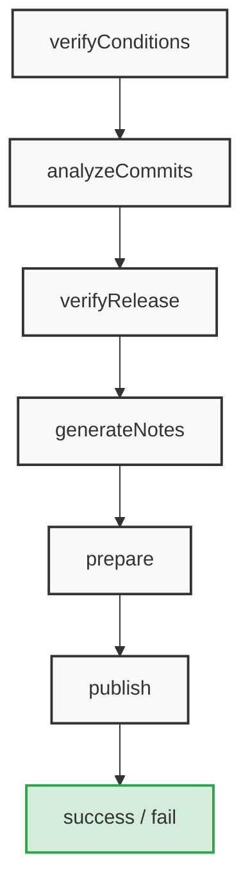

# :shopping_cart: Create a GitHub Action Using TypeScript


[](https://github.com/stairwaytowonderland/typescript-action-template/releases)
[](https://github.com/stairwaytowonderland/typescript-action-template/commits/main)
[](https://github.com/stairwaytowonderland/typescript-action-template/tree/main/LICENSE)
[](https://github.com/semantic-release/semantic-release)
[](https://github.com/pre-commit/pre-commit)

## :pushpin: Overview

Use this template to bootstrap the creation of a TypeScript action.

This template includes compilation support, tests, a validation workflow,
publishing, and versioning guidance.

If you are new, there's also a simpler introduction in the
[Hello world JavaScript action repository](https://github.com/actions/hello-world-javascript-action).

## :cactus: Project structure

> [!TIP]
>
> For the `.github` folder file structure, see its [`index.md`](./.github/index.md).

<details>
<summary><b>Project file structure</b> <i>(Click to expand) ...</i></summary><br>

> :seedling: `tree -a -F -L 2 -I '.git|.vscode|.devcontainer' --gitignore --dirsfirst .`

```none
./
├── __fixtures__/
│   ├── core.ts
│   └── wait.ts
├── __tests__/
│   ├── main.test.ts
│   └── wait.test.ts
├── .github/
│   ├── codeql/
│   ├── workflows/
│   ├── CODEOWNERS
│   ├── dependabot.yml
│   └── index.md
├── .licenses/
│   └── npm/
├── badges/
│   └── coverage.svg
├── dist/
│   ├── index.js
│   └── index.js.map
├── script/
│   └── release*
├── src/
│   ├── index.ts
│   ├── main.ts
│   └── wait.ts
├── .checkov.yml
├── .editorconfig
├── .env.example
├── .gitattributes
├── .gitignore
├── .licensed.yml
├── .markdownlint.json
├── .node-version
├── .npmrc
├── .pre-commit-config.yaml
├── .prettierignore
├── .prettierrc
├── .releaserc
├── .yaml-lint.yml
├── action.yaml
├── actionlint.yml
├── eslint.config.mjs
├── jest.config.js
├── LICENSE
├── package-lock.json
├── package.json
├── README.md
├── rollup.config.ts
├── TODO.csv
├── TODO.example.csv
└── tsconfig.json
```

</details>

---
<!-- REMOVE BELOW -->

## :rocket: Getting started

### :white_check_mark: First tasks

- [ ] **:one: :clipboard: Create your repo:** Use this template to
[**Create your own action**](#clipboard-create-your-own-action)! :tada:
- [ ] **:two: :label: Create some labels:** Run the [Create Labels](https://github.com/stairwaytowonderland/typescript-action-template/actions/workflows/create-labels.yaml)
_workflow_ to create some additional useful labels.
- [ ] **:three: :bookmark: Create some issues:** Run the [Import Issues from CSV](https://github.com/stairwaytowonderland/typescript-action-template/actions/workflows/import-csv-issues.yaml)
  _workflow_ to import first issues using the provided sample _`TODO.csv`_.
- [ ] **:four: :ticket: Complete the _Dependabot Test_:**
  Review, approve, and merge the _Pull Request (**PR**)_ generated by **dependabot**.

  > :memo: The **PR** should have a title similar to the following:
  >
  > ```none
  > ci(deps): bump actions/checkout from 6 to X ...
  > ```

- [ ] **:five: :wrench: Customize your _action_:**
  Customize the [`README.md`](./README.md), [`CODEOWNERS`](./.github/CODEOWNERS), [`LICENSE`](./LICENSE),
  [`action.yaml`](./action.yaml), and [`package.json`](./package.json)
  _(**+** [`package-lock.json`](./package-lock.json))_ files, to include project-specific information and instructions.
- [ ] **:six: :trophy: _(BONUS)_ :art: Install `pre-commit`:** Install `pre-commit` locally
and configure it (using [.pre-commit-config.yaml](./.pre-commit-config.yaml)) to ensure proper formatting, mitigating
workflow failures.
_(See [Development Guidelines](https://github.com/stairwaytowonderland/repository-template?tab=contributing-ov-file#development-guidelines) for details)_

### :clipboard: Create Your Own Action

To create your own action, you can use this repository as a template! Just
follow the below instructions:

#### :a: _Option "A"_

**Use this template _(recommended)_**

1. Click the **Use this template** button at the top of the repository
1. Select **Create a new repository**
1. Select an owner and name for your new repository
1. Click **Create repository**
1. Clone your new repository

> [!IMPORTANT]
>
> :classical_building: Make sure to remove or update the [`CODEOWNERS`](./.github/CODEOWNERS) file!<br>_(For
> details on how to use this file, see
> [About code owners](https://docs.github.com/en/repositories/managing-your-repositorys-settings-and-features/customizing-your-repository/about-code-owners).)_
>
> :books: Make sure to  update the [`README.md`](./README.md) and the [`LICENSE`](./LICENSE) files accordingly!
>
> :wrench: Make sure to [**Update the Action Metadata**](#wrench-update-the-action-metadata)
([`action.yaml`](#zap-actionyaml) and [`package.json`](#toolbox-packagejson))! :rotating_light:

#### :b: _Option "B"_

<details>
<summary><b>Manual Creation</b> <i>(Click to expand) ...</i></summary>

1. **Clone this repo:**

    ```bash
    git clone git@github.com:stairwaytowonderland/repository-template.git
    ```

1. **Create a new empty repo:**

    Use the **_UI_** to [create a new repository](https://github.com/new).

1. **Initialize from the command line:**

    ```bash
    # Change directory into the cloned template
    cd /path/to/cloned/template

    # Delete the .git folder from cloned template
    rm -rf .git

    # Optionally overwrite the README with your content
    echo "# Repository Template" > README.md

    # Initialize new git local repository
    git init

    # Set default branch
    git branch -M main

    # Make first commit empty to allow easier rebasing
    git commit --no-verify --allow-empty -m "chore: initial empty commit"

    # Install pre-commit hooks
    # (make sure `pre-commit` is installed ... install it using `pip` or `brew`)
    pre-commit install

    # Add all files (make sure your .gitignore file is properly configured)
    git add .

    # Second commit
    git commit -m "chore: adding initial files"

    # Set the remote to the new repo you manually created (step 2) ...
    # To update the url (instead of add), use `git remote set-url origin <GIT_URL>`
    git remote add origin git@github.com:<user-or-org>/<new-empty-repo>.git

    # Push to remote
    git push -u origin main
    ```

</details>

## :video_game: Usage

After testing, you can create version tag(s) that developers can use to
reference different stable versions of your action. For more information, see
[Versioning](https://github.com/actions/toolkit/blob/main/docs/action-versioning.md)
in the GitHub Actions toolkit.

To include the action in a workflow in another repository, you can use the
`uses` syntax with the `@` symbol to reference a specific branch, tag, or commit
hash.

```yaml
- uses: stairwaytowonderland/typescript-action-template@v1
  with:
    # Your input description here.
    # Default: 1000
    milliseconds: 1000
```

> [!NOTE]
>
> :key: Permissions
>
> As a best practice use `contents:read` permissions unless otherwise required:
>
> ```yaml
> permissions:
>   contents: read
> ```

### :computer: Example

```yaml
name: CI

on:
  push:
  pull_request:

permissions:
  contents: read

jobs:
  ci:
    name: Use My Custom Action
    runs-on: ubuntu-latest
    steps:
      - name: Checkout
        id: checkout
        uses: actions/checkout@v7

      - name: My Custom Action
        id: custom-action
        uses: stairwaytowonderland/typescript-action-template@v1 # Commit with the `v1` tag
        with:
          milliseconds: 1000

      - name: Print Output
        id: output
        run: echo "${{ steps.custom-action.outputs.time }}"
```

## :gear: Initial Setup

After you've cloned the repository to your local machine or codespace, you'll
need to perform some initial setup steps before you can develop your action.

> [!NOTE]
>
> You'll need to have a reasonably modern version of
> [Node.js](https://nodejs.org) handy (20.x or later should work!). If you are
> using a version manager like [`nodenv`](https://github.com/nodenv/nodenv) or
> [`fnm`](https://github.com/Schniz/fnm), this template has a `.node-version`
> file at the root of the repository that can be used to automatically switch to
> the correct version when you `cd` into the repository. Additionally, this
> `.node-version` file is used by GitHub Actions in any `actions/setup-node`
> actions.

1. :hammer_and_wrench: Install the dependencies

   ```bash
   npm install
   ```

1. :building_construction: Package the TypeScript for distribution

   ```bash
   npm run bundle
   ```

1. :test_tube: Run the tests

   ```bash
   $ npm test

    PASS  __tests__/wait.test.ts
    wait.ts
     ✓ Throws an invalid number (3 ms)
     ✓ Waits with a valid number (502 ms)

    PASS  __tests__/main.test.ts
    main.ts
     ✓ Sets the time output (1 ms)
     ✓ Sets a failed status
   ```

1. :broom: Format and lint

    ```bash
    # Use `npm run format:check` to check only
    $ npm run format:write

    > typescript-action@0.0.0 format:write
    > npx prettier --write .

    $ npm run lint

    > typescript-action@0.0.0 lint
    > npx eslint .
    ...
    ```

1. :surfer: Run them all _(recommended)_

    ```bash
    $ npm run all
    ...
    ```

## :wrench: Update the Action Metadata

### :zap: `action.yaml`

The [`action.yaml`](action.yaml) file defines metadata about your action, such
as input(s) and output(s). For details about this file, see
[Metadata syntax for GitHub Actions](https://docs.github.com/en/actions/creating-actions/metadata-syntax-for-github-actions).

When you copy this repository, update `action.yaml` with the name, description,
inputs, and outputs for your action.

### :toolbox: `package.json`

**Make sure to update [`package.json`](./package.json)!** :rotating_light:

The package.json file serves as the manifest and configuration hub for any Node.js project or npm package
_(See the [**official docs**](https://docs.npmjs.com/cli/v7/configuring-npm/package-json) for more information)_:

1. <details>
    <summary><b>‼️ You <b>must</b> update <i>at least</i> the
    <a href="https://docs.npmjs.com/cli/v7/configuring-npm/package-json#homepage"><code>homepage</code></a>,
    <a href="https://docs.npmjs.com/cli/v7/configuring-npm/package-json#repository"><code>repository</code></a>, and
    <a href="https://docs.npmjs.com/cli/v7/configuring-npm/package-json#bugs"><code>bugs</code></a> <i>urls</i> or your
    action won't publish</b> <i>(Expand for details) ...</i></summary><br>

    Update the following fields and urls appropriately, to match your
own repository:

    ```json
    {
        "name": "typescript-action-template",
        "description": "GitHub Actions TypeScript template",
        "author": "",
        "homepage": "https://github.com/stairwaytowonderland/typescript-action-template",
        "repository": {
            "type": "git",
            "url": "git+https://github.com/stairwaytowonderland/typescript-action-template.git"
        },
        "bugs": {
            "url": "https://github.com/stairwaytowonderland/typescript-action-template/issues"
        },
        ...
    }
    ```

    </details>

1. :hammer: After updating, run `npm run clean && npm install && npm run all` to build your action and prepare it
for commit.

## :keyboard: Update the Action Code

The [`src/`](./src/) directory is the heart of your action! This contains the
source code that will be run when your action is invoked. You can replace the
contents of this directory with your own code.

There are a few things to keep in mind when writing your action code:

- Most GitHub Actions toolkit and CI/CD operations are processed asynchronously.
  In `main.ts`, you will see that the action is run in an `async` function.

  ```javascript
  import * as core from '@actions/core'
  //...

  async function run() {
    try {
      //...
    } catch (error) {
      core.setFailed(error.message)
    }
  }
  ```

  For more information about the GitHub Actions toolkit, see the
  [documentation](https://github.com/actions/toolkit/blob/main/README.md).

:rocket: So, what are you waiting for? Go ahead and start customizing your action!

1. Create a new branch

   ```bash
   git checkout -b releases/v1
   ```

1. Replace the contents of `src/` with your action code
1. Add tests to `__tests__/` for your source code
1. Format, test, and build the action

   ```bash
   npm run all
   ```

   > This step is important! It will run [`rollup`](https://rollupjs.org/) to
   > build the final JavaScript action code with all dependencies included. If
   > you do not run this step, your action will not work correctly when it is
   > used in a workflow.

1. :microscope: (Optional) Test your action locally

   The [`@github/local-action`](https://github.com/github/local-action) utility
   can be used to test your action locally. It is a simple command-line tool
   that "stubs" (or simulates) the GitHub Actions Toolkit. This way, you can run
   your TypeScript action locally without having to commit and push your changes
   to a repository.

   The `local-action` utility can be run in the following ways:
   - Visual Studio Code Debugger

     Make sure to review and, if needed, update
     [`.vscode/launch.json`](./.vscode/launch.json)

   - Terminal/Command Prompt

     ```bash
     # npx @github/local action <action-yaml-path> <entrypoint> <dotenv-file>
     npx @github/local-action . src/main.ts .env
     ```

   You can provide a `.env` file to the `local-action` CLI to set environment
   variables used by the GitHub Actions Toolkit. For example, setting inputs and
   event payload data used by your action. For more information, see the example
   file, [`.env.example`](./.env.example), and the
   [GitHub Actions Documentation](https://docs.github.com/en/actions/learn-github-actions/variables#default-environment-variables).

1. Commit your changes

   ```bash
   git add .
   git commit -m "My first action is ready!"
   ```

1. Push them to your repository

   ```bash
   git push -u origin releases/v1
   ```

1. Create a pull request and get feedback on your action
1. Merge the pull request into the `main` branch

**Your action is now published! :tada:**

For information about versioning your action, see the [Publishing a New Release](#package-publishing-a-new-release) section.

For additional guidance, see
[Versioning](https://github.com/actions/toolkit/blob/main/docs/action-versioning.md)
in the GitHub Actions toolkit.

## :bell: Validate the Action

You can now validate the action by referencing it in a workflow file. For
example, [`test.yaml`](./.github/workflows/test.yaml) demonstrates how to
reference an action in the same repository.

```yaml
steps:
  - name: Checkout
    id: checkout
    uses: actions/checkout@v4

  - name: Test Local Action
    id: test-action
    uses: ./
    with:
      milliseconds: 1000

  - name: Print Output
    id: output
    run: echo "${{ steps.test-action.outputs.time }}"
```

For example workflow runs, check out the
[Actions tab](https://github.com/stairwaytowonderland/typescript-action-template/actions)! :rocket:

## :package: Publishing a New Release

This template uses **`semantic-release`** with the _conventionalcommits_ preset by default.

### :label: Creating Tags and Releases

The **creation of tags and releases is handled _automatically_** by the pre-configured [_workflows_](./.github/workflows/).

### :page_with_curl: Disabling the `CHANGELOG`

<details>
<summary><b>To prevent the automatically generated <code>CHANGELOG</code> from being committed</b>
<i>(Expand for details) ...</i></summary>

1. Remove the **_entire_** `@semantic-release/changelog` _plugin_ configuration in your [`.releaserc`](./.releaserc):

    ```json
    [
        "@semantic-release/changelog",
        {
            "changelogFile": "CHANGELOG.md"
        }
    ]
    ```

1. From the `@semantic-release/git` _plugin_ configuration in your
[`.releaserc`](./.releaserc), remove the `CHANGELOG.md` asset:

    ```json
    [
      "@semantic-release/git",
      {
        "assets": ["package.json", "package-lock.json"],
        "message": "chore(release): ${nextRelease.version}\n\n${nextRelease.notes}"
      }
    ]
    ```

    > :memo: **Note:** if `CHANGELOG.md` is the only asset listed, remove the **_entire_** `@semantic-release/git` block.

</details>

### :electric_plug: _"RC"_ Plugin ordering

<details>
<summary><b>The order of <code>.releaserc</code> <i>plugins</i> DOES matter</b>
<i>(Expand for details) ...</i></summary><br>

The **order of _plugins_ DOES matter** in the _release configuration file (`.releaserc`)_!

:1234: The recommended order for the _`plugins` array_ is:

```json
[
    "@semantic-release/commit-analyzer",
    "@semantic-release/release-notes-generator",
    "@semantic-release/changelog",
    "@semantic-release/npm",
    "@semantic-release/git",
    "@semantic-release/github",
    "semantic-release-export-data"
]
```

#### Why This Exact Order Matters

- [@semantic-release/commit-analyzer](https://github.com/semantic-release/commit-analyzer): Must go first to scan your
commits and determine the next semantic version bump
(_major_, _minor_, or _patch_).
- [@semantic-release/release-notes-generator](https://github.com/semantic-release/release-notes-generator): Compiles
the release notes based on those commits.
- [@semantic-release/changelog](https://github.com/semantic-release/changelog): Must be placed before the `git` and `npm`
plugins. It creates or updates the physical `CHANGELOG.md` file so downstream plugins can package and commit it.
- [@semantic-release/npm](https://github.com/semantic-release/npm): Must run before the Git plugin. It updates the
version string in package.json. If placed after `git`, the version bump won't be committed to your repository.
- [@semantic-release/git](https://github.com/semantic-release/git): Consolidates the modified CHANGELOG.md and
package.json, then creates the release commit and pushes it back to your repository.
- [@semantic-release/github](https://github.com/semantic-release/github)
(or [`gitlab`](https://github.com/semantic-release/gitlab)): Placed last to finalize the process by publishing the
GitHub Release, uploading build assets, and posting automated comments on resolved issues or PRs.
- [semantic-release-export-data](https://github.com/felipecrs/semantic-release-export-data): Can be placed anywhere in
your plugins array, but the most reliable approach is to add it at the very end of your plugin list.
It does not modify code, commit files, or change your package repository. _It is a passive plugin designed solely to
hook into the prepare, publish, and success [lifecycles](https://semantic-release.org/developer-guide/plugin/) to extract data generated by previous steps (like the version
determined by the `commit-analyzer`) and write it out as environment/GitHub Actions variables._

See the [**official docs**](https://semantic-release.org/developer-guide/plugin/) for more information.

#### How the Steps Execute Internally



</details>

## :credit_card: Dependency License Management

This template includes a GitHub Actions workflow,
[`licensed.yaml`](./.github/workflows/licensed.yaml), that uses
[Licensed](https://github.com/licensee/licensed) to check for dependencies with
missing or non-compliant licenses. This workflow is initially disabled.

<details>
<summary><b>To enable the workflow, do the following</b> <i>(Expand for details) ...</i></summary>

1. Open [`licensed.yaml`](./.github/workflows/licensed.yaml)
1. Uncomment the following lines:

   ```yaml
   # pull_request:
   #   branches:
   #     - main
   # push:
   #   branches:
   #     - main
   ```

1. Save and commit the changes

Once complete, this workflow will run any time a pull request is created or
changes pushed directly to `main`. If the workflow detects any dependencies with
missing or non-compliant licenses, it will fail the workflow and provide details
on the issue(s) found.

</details>

### :lock_with_ink_pen: Updating Licenses

<details>
<summary><b>Use the Licensed CLI to
update the licenses database</b> <i>(Expand for details) ...</i></summary><br>

Whenever you install or update dependencies, you can use the Licensed CLI to
update the licenses database. To install Licensed, see the project's
[Readme](https://github.com/licensee/licensed?tab=readme-ov-file#installation).

To update the cached licenses, run the following command:

```bash
licensed cache
```

To check the status of cached licenses, run the following command:

```bash
licensed status
```

</details>

## :paintbrush: Further customizations

### :fountain_pen: Contributing details

For customized **contributing details**, create a **`CONTRIBUTING.md`** in this repo:

```bash
echo "# Contributing Guidelines" > CONTRIBUTING.md
```

> [!TIP]
>
> You may copy this organization's [`CONTRIBUTING.md`](https://github.com/stairwaytowonderland/.github/blob/main/CONTRIBUTING.md)
> file as a starting point.

### :lady_beetle: Issues and PRs

For simplicity reasons, this template repo doesn't include the **`ISSUE_TEMPLATE`** and **`PULL_REQUEST_TEMPLATE`** _(.md)_
files.

> [!NOTE]
>
> **_If using this template in another org_, or to _add those files to your project for further customization_**, copy
> them from this organization's [_special .github repo_](https://github.com/stairwaytowonderland/.github/tree/main/.github).

## :ocean: Essential tools

- :white_check_mark: [Visual Studio Code](https://code.visualstudio.com/) (a.k.a. _VS Code_)
- :white_check_mark: [EditorConfig](https://editorconfig.org/)
- :white_check_mark: [pre-commit](https://pre-commit.com/)
- :white_check_mark: [Prettier](https://prettier.io/)

  > :memo: **Note:** For a more customized experience, some files might need to be excluded from _Prettier_.
  >
  > See the [official docs](https://prettier.io/docs/ignore) for details on ignoring code.

---
<!-- REMOVE ABOVE -->

## :sparkles: Contributing

### :speech_balloon: Commit Message Guidelines

- Write clear, concise commit messages that follow the
  [](https://www.conventionalcommits.org/)&nbsp;standard.
- The allowed _prefixes_ for this project are the following:

  ```json
  [
    "build",
    "chore",
    "ci",
    "docs",
    "feat",
    "fix",
    "perf",
    "refactor",
    "revert",
    "style",
    "test"
  ]
  ```

> [!NOTE]
>
> See
> [Contributing Guidelines](https://github.com/stairwaytowonderland/typescript-action-template?tab=contributing-ov-file#contributing-guidelines)
> for more information.
